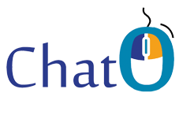

## Índice
1. ¿Qué es ChatO?
2. Descripción
3. Objetivo
4. Quiénes somos
5. Agradecimientos
6. Licencia

##1. ¿Qué es ChatO?

Nuestro proyecto consiste en la creación de un Chat para Quental mediante el cual se podrán resolver dudas técnicas a sus clientes, en concreto Cruz Roja y Telefónica. El Chat se ha desarrollado siguiendo las especificaciones del cliente y mediante el uso de diversas tecnologías. 
Para llevar a cabo el diseño del chat, hemos utilizado Liferay que es un portal de gestión de contenidos de código abierto escrito en Java. Un portal se define generalmente como una plataforma de software para construir aplicaciones y sitios web. Las plataformas de portal facilitan a los usuarios la construcción de páginas web y sitios web mediante el ensamblaje de Portlets en una página de portal. 
Hemos creado dos Portlets para desarrollar todas las funcionalidades del proyecto, uno para el lado cliente y otro para el lado Quental.  

##2. Descripción

Dicho chat permitirá poner en contacto y en tiempo real a un equipo de soporte con un técnico del lado del cliente, que será el que expondrá sus dudas. 

##3. Objetivo

Crear una herramienta que facilite el trabajo del cliente en sus desarrollos internos utilizando la tecnología Liferay, es decir que será un SPOC (Single Point Of Contact).

##4. Quiénes somos

+ [Guillermo Pastor Peña](https://es.linkedin.com/in/guillermopastorpena "linkedin de Guillermo") | [@guilermo_org](https://twitter.com/guillermo_org) | <guillermopaspe@gmail.com>
+ [Fernando Castro Martín](https://es.linkedin.com/in/fernandocastromartin "linkedin de Fernando") | [@fercm89](https://twitter.com/fercm89) | <fercm89@gmail.com>  
+ [Mónica López Fernández](https://es.linkedin.com/in/mlopezfernandez "linkedin de Mónica") | [@Moni_lopezF](https://twitter.com/Moni_lopezF) | <mlopezfernandez@gmail.com>  
+ [Marta García Nevado](https://es.linkedin.com/in/martagarcianevado " linkedin de Marta") | [@Martagarcia_88](https://twitter.com/Martagarcia_88) | <marta.garcia.nevado@gmail.com>  
+ [Svetlana Stefanova Ivanova](https://es.linkedin.com/in/svetlana-stefanova-ivanova-a93713a8 "linkedin de Svetlana") | <vsvetla13@yahoo.com>  
+ [Raquel Sánchez Barahona](https://es.linkedin.com/in/raquelsanchezbarahona "linkedin de Raquel") | [@raquelsbarahona](https://twitter.com/raquelsbarahona) | <raquelsbarahona@gmail.com>  
+ [Juan Blasco Cuenca](https://es.linkedin.com/in/juanblascocuenca "linkedin de Juan") | [@johan_jbc](https://twitter.com/johan_jbc) | <jblascocuenca@gmail.com>  
+ [Irene Fender Soler](https://es.linkedin.com/in/irene-fender-soler-1551a614 "linkedinde Irene") | <irenefender@gmail.com>  
+ [Miguel Ángel Monsalve Pardo](https://es.linkedin.com/in/mimonsalve "linkedin de Miguel") | [@_MonsalveP_](https://twitter.com/_MonsalveP_) | <miguel.monsalve@gmail.com>  
+ [Sergio Rojo Herrero](https://es.linkedin.com/in/sergiorojoherrero "linkedin de Sergio") | [@SRojoHerrero](https://twitter.com/SRojoHerrero) | <rojoherrero@gmail.com>  

##5. Agradecimientos

Queremos agradecer la ayuda recibida para conseguir que este proyecto llegue a buen puerto a:
+ [Talentum Empleo](http://talentumempleo.com/ "Página WEb Talentum Empleo"): [Luz](https://twitter.com/LuzGarridoG ""), [Carolina](https://twitter.com/CarolinaRmontes ""), [Elena](https://twitter.com/elena_anderez "").
+ Profesores: [Antonio](https://twitter.com/AjmsMartin ""), [Amelia](https://es.linkedin.com/in/amelia-gonzález-lópez-548ba227 ""), [Victor](https://twitter.com/VictorHerrero1 ""), [Rubén](https://twitter.com/rubgomez ""),
+ [The Bold Choice](http://theboldchoice.com/): [Jane](https://twitter.com/JanedelTronco ""), [Noemí](https://twitter.com/_TIRURIRU_ ""), [Rosa](https://twitter.com/RosadelTronco ""), [Miriam](https://twitter.com/MiryGc "") y [Berta](https://twitter.com/BertaAlvarezC ""),
+ [Thinking with you](http://thinkingwithyou.com/): [Israel Alcazar](https://twitter.com/ialcazar "") y [Florentino](https://twitter.com/worldintino ""),
+ [h4ckademy](http://www.h4ckademy.com/): [Israel Gutiérrez](https://twitter.com/gootyfer ""),
+ [Quental](http://www.quental.com/): [Ángel](https://es.linkedin.com/in/ángel-gárgoles-rodríguez-85b46726 ""), [Álvaro](https://twitter.com/AButragueno ""), [Mirian](https://es.linkedin.com/in/mirian-arrabal-trigueros-3023166b ""), [Jorge](https://es.linkedin.com/in/jorge-rodriguez-de-lazaro-62698b40 ""),

#MUCHAS GRACIAS A TODOS

##5. Licencia

Esta obra se distribulle bajo licencia GNU GPLv3

